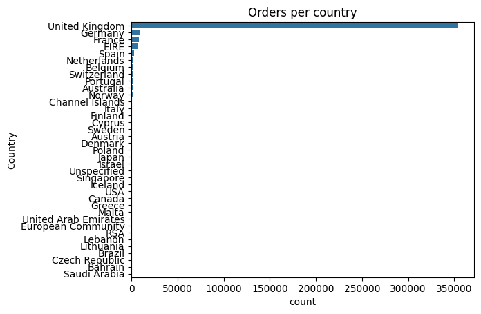
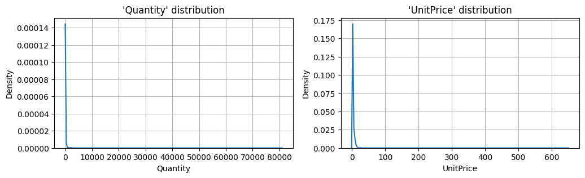
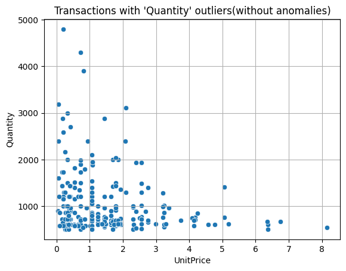
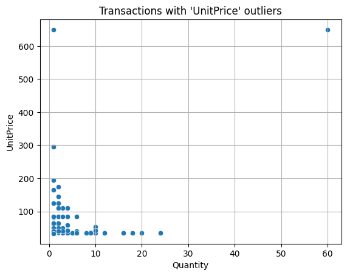
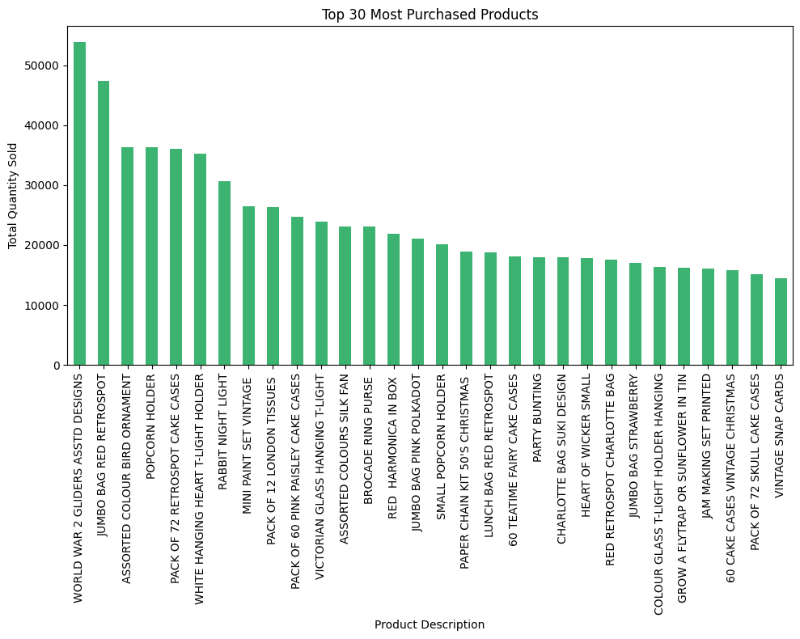
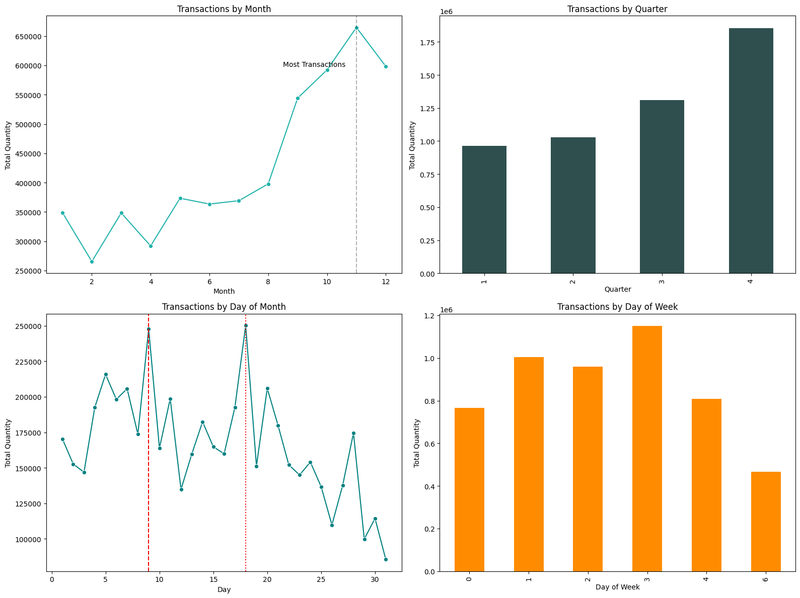

# Online Retail Data Analysis

Understanding customer behavior is crucial for business success in online retail or e-commerce. This project aims to uncover hidden patterns in customer transactions, identify distinct customer segments, and provide data-driven recommendations for improving customer retention and maximizing revenue.  
This project uses [online retail data](https://archive.ics.uci.edu/dataset/352/online+retail) from the UCI Machine Learning Repository.The dataset contains transactional data from a UK-based online retail company.   

## Data Dictionary

| Variable Name | Role | Type | Description |
|---------------|------|------|-------------|
| InvoiceNo | ID | Categorical | A 6-digit integral number uniquely assigned to each transaction. If this code starts with letter 'c', it indicates a cancellation |
| StockCode | ID | Categorical | A 5-digit integral number uniquely assigned to each distinct product |
| Description | Feature | Categorical | Product name |
| Quantity | Feature | Integer | The quantities of each product (item) per transaction |
| InvoiceDate | Feature | Date | The day and time when each transaction was generated |
| UnitPrice | Feature | Continuous | Product price per unit |
| CustomerID | Feature | Categorical | A 5-digit integral number uniquely assigned to each customer |
| Country | Feature | Categorical | The name of the country where each customer resides |

The three critical questions that every retailer should ask to determine their strategic direction and profitability: 

1. **Who are your customers?**  
Understanding your customer base is about identifying behavioral patterns, purchase preferences, and value contribution. Are you serving mew customers, premium buyers, or loyal repeat customers? Each segment requires different approaches, messaging, and investment strategies.

2. **What do they buy together?**  
Product relationships drive significant revenue opportunities. When customers purchase item A, what else do they typically buy? These associations reveal cross-selling opportunities, inform inventory decisions, and optimize product placement strategies that can increase average order value by 10-30%.

3. **How are we doing in keeping customers coming back?**  
Understanding retention patterns helps identify when customers are likely to churn, how different customer cohorts behave over time, and what interventions can improve overall customer retention rates.

We'll answer these questions using:

- **Question 1:-**  
    **RFM-Based Customer Segmentation:** Analyzing Recency, Frequency, and Monetary patterns to create actionable customer personas
- **Question 2:-**  
     **Market Basket Analysis:** Uncovering product associations and purchase patterns through association rule mining.
- **Question 3:-**  
     **Cohort and Retention Analysis:** Tracking customer behavior over time to measure loyalty and identify retention opportunities.

But before diving into these advanced analyses, we'll begin with thorough Exploratory Data Analysis (EDA) and Data Cleaning.

# Table of Contents

- [EDA & Data Cleaning](#eda--data-cleaning)
- [Customer Segmentation](#customer-segmentation)
- [Market Basket Analysis](#market-basket-analysis)
- [Cohort and Retention Analysis](#cohort-and-retention-analysis)

## EDA & Data Cleaning

Dataset contains **542,909 transactions**, from December 2010 to December 2011.  
The initial data quality assessment revealed: 
- **Description column**: Contains null values for certain transactions.
- **CustomerID column**: Significant number of missing values (~25% of records)
- **Co-occurrence**: Many records have both Description and CustomerID missing simultaneously

Apart from Market Basket Analysis(MBA),we will need to remove all Null Values. This is because there is no way to impute these values and we are dealing with customer related analysis, you can do even without CustomerId,but we will remove null values for that too.

**1. Invoice Number Validation**
- Identified transactions with invoice numbers starting with 'C' (cancellations) and 'A' (adjustments).
- Retained only standard 6-digit invoice numbers for consistent transaction analysis.
- Removed ~10,000 cancelled and adjusted transactions.

**2. Stock Code Standardization**
- Expected format: 5-digit codes (e.g., "85123") or 5-digit codes with letter suffixes (e.g., "85123A").
- Identified ~54,000 entries with non-standard stock codes.
- Removed irregular patterns to maintain data consistency.

**3. Price and Quantity Validation**
- **Negative Quantities**: Removed as they represent returns and cancellations
- **Zero/Negative Prices**: Eliminated zero-price entries (promotional/sample items) and negative prices (data entry errors)
- **Final Clean Dataset**: 396337 valid transactions

The dataset reveals a strong geographic concentration:
- **United Kingdom**: 89.7% of all orders
- **Germany**: 2.3% of orders
- **France**: 1.9% of orders
- **Ireland (EIRE)**: 1.7% of orders

This distribution aligns with the company's UK-based operations and domestic market focus.  
When checked for the distribution of order volume by country, *United Kingdom* came at the top again cornering major chunk of it.

While looking at the distribution characterstic of various columns we observe:
- **Quantity**: Heavily right-skewed distribution with most orders between 1-12 items
- **Unit Price**: Right-skewed with majority of products priced under £5

  

- **Outliers**: Identified extreme values (quantities >80,000 and prices >£600) representing bulk orders,niche products or data anomalies.
- Outliers are dealt seperately on case basis in each of the three problems.

  
  
  

The analysis of the most frequently purchased items reveals:
- Strong preference for decorative and gift items
- Seasonal patterns in product popularity
- Bulk purchasing behavior for certain product categories

  

On looking at the data w.r.t. date-time,we observed that:
- **Peak Month**: November shows highest transaction volumes (holiday shopping effect)
- **Peak Quarter**: Q4 dominates with 35% of annual transactions
- **Peak Day**: Wednesday shows highest transaction activity
- **Lowest Day**: Sunday has minimal transaction volume
- **Monthly Cycles**: Noticeable spikes on the 9th and 18th of each month (potentially payday effects)
- **Business Growth**: Significant expansion from 2010 to 2011

  

**EDA insights:**

1. **Customer Concentration**: 89.7% of business comes from UK customers, indicating strong domestic market penetration
2. **Product Portfolio**: Wide range of unit prices suggests diverse product mix from low-cost to premium items
3. **Seasonal Sensitivity**: Strong Q4 performance indicates holiday shopping dependence
4. **Growth Trajectory**: Rapid international expansion and transaction volume growth
5. **Data Quality**: After cleaning, we retained 74% of original data for robust analysis

## Customer Segmentation

- Implementing K-means clustering algorithm to identify distinct customer groups
- Analyzing customer behavior using RFM (Recency, Frequency, Monetary) analysis
- Creating detailed customer personas based on purchasing patterns
- Providing targeted marketing strategies for each segment

## Market Basket Analysis

- Discovering associations between products frequently purchased together
- Implementing association rule mining techniques (Apriori algorithm)
- Identifying cross-selling and upselling opportunities
- Optimizing product placement and recommendation systems

## Cohort and Retention Analysis

- Tracking customer retention rates over time
- Analyzing customer lifetime value and churn patterns
- Identifying factors that influence customer loyalty
- Developing strategies to improve customer retention

## Business Impact

The insights generated from this analysis will enable the retail company to:
- Develop personalized marketing campaigns for different customer segments
- Optimize inventory management and product bundling strategies
- Improve customer retention through targeted interventions
- Increase revenue through strategic cross-selling and upselling
- Make data-driven decisions for business growth

## Technologies Used

- **Python** for data analysis and visualization
- **Pandas & NumPy** for data manipulation
- **Scikit-learn** for clustering algorithms
- **Matplotlib & Seaborn** for visualization
- **MLxtend** for market basket analysis
- **Plotly** for interactive visualizations

