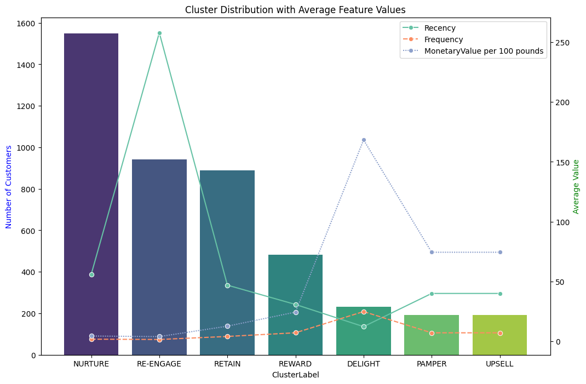

# Online Retail Data Analysis

Understanding customer behavior is crucial for business success in online retail or e-commerce. This project aims to uncover hidden patterns in customer transactions, identify distinct customer segments, and provide data-driven recommendations for improving customer retention and maximizing revenue. <br>
This project uses [online retail data](https://archive.ics.uci.edu/dataset/352/online+retail) from the UCI Machine Learning Repository.The dataset contains transactional data from a UK-based online retail company. <br> 

# Table of Contents

- [Data Dictionary](#data-dictionary)
- [EDA & Data Cleaning](#eda--data-cleaning)
- [Customer Segmentation](#customer-segmentation)
- [Market Basket Analysis](#market-basket-analysis)
- [Cohort and Retention Analysis](#cohort-and-retention-analysis)

# Data Dictionary

| Variable Name | Role | Type | Description |
|---------------|------|------|-------------|
| InvoiceNo | ID | Categorical | A 6-digit integral number uniquely assigned to each transaction. If this code starts with letter 'c', it indicates a cancellation |
| StockCode | ID | Categorical | A 5-digit integral number uniquely assigned to each distinct product |
| Description | Feature | Categorical | Product name |
| Quantity | Feature | Integer | The quantities of each product (item) per transaction |
| InvoiceDate | Feature | Date | The day and time when each transaction was generated |
| UnitPrice | Feature | Continuous | Product price per unit |
| CustomerID | Feature | Categorical | A 5-digit integral number uniquely assigned to each customer |
| Country | Feature | Categorical | The name of the country where each customer resides |

The three critical questions that every retailer should ask to determine their strategic direction and profitability: 

1. **Who are your customers?** <br>
Understanding your customer base is about identifying behavioral patterns, purchase preferences, and value contribution. Are you serving mew customers, premium buyers, or loyal repeat customers? Each segment requires different approaches, messaging, and investment strategies.

2. **What do they buy together?** <br>
Product relationships drive significant revenue opportunities. When customers purchase item A, what else do they typically buy? These associations reveal cross-selling opportunities, inform inventory decisions, and optimize product placement strategies that can increase average order value by 10-30%.

3. **How are we doing in keeping customers coming back?** <br>
Understanding retention patterns helps identify when customers are likely to churn, how different customer cohorts behave over time, and what interventions can improve overall customer retention rates.

We'll answer these questions using:

- **Question 1:-** <br>
    **RFM-Based Customer Segmentation:** Analyzing Recency, Frequency, and Monetary patterns to create actionable customer personas
- **Question 2:-** <br>
     **Market Basket Analysis:** Uncovering product associations and purchase patterns through association rule mining.
- **Question 3:-** <br>
     **Cohort and Retention Analysis:** Tracking customer behavior over time to measure loyalty and identify retention opportunities.

But before diving into these advanced analyses, we'll begin with thorough Exploratory Data Analysis (EDA) and Data Cleaning.

# EDA & Data Cleaning

Dataset contains **542,909 transactions**, from December 2010 to December 2011. <br>
The initial data quality assessment revealed: 
- **Description column**: Contains null values for certain transactions.
- **CustomerID column**: Significant number of missing values (~25% of records)
- **Co-occurrence**: Many records have both Description and CustomerID missing simultaneously

Apart from Market Basket Analysis(MBA),we will need to remove all Null Values. This is because there is no way to impute these values and we are dealing with customer related analysis, you can do even without CustomerId,but we will remove null values for that too.

**1. Invoice Number Validation**
- Identified transactions with invoice numbers starting with 'C' (cancellations) and 'A' (adjustments).
- Retained only standard 6-digit invoice numbers for consistent transaction analysis.
- Removed ~10,000 cancelled and adjusted transactions.

**2. Stock Code Standardization**
- Expected format: 5-digit codes (e.g., "85123") or 5-digit codes with letter suffixes (e.g., "85123A").
- Identified ~54,000 entries with non-standard stock codes.
- Removed irregular patterns to maintain data consistency.

**3. Price and Quantity Validation**
- **Negative Quantities**: Removed as they represent returns and cancellations
- **Zero/Negative Prices**: Eliminated zero-price entries (promotional/sample items) and negative prices (data entry errors)
- **Final Clean Dataset**: 396337 valid transactions

The dataset reveals a strong geographic concentration:
- **United Kingdom**: 89.7% of all orders
- **Germany**: 2.3% of orders
- **France**: 1.9% of orders
- **Ireland (EIRE)**: 1.7% of orders


This distribution aligns with the company's UK-based operations and domestic market focus. <br>
When checked for the distribution of order volume by country, *United Kingdom* came at the top again cornering major chunk of it.

While looking at the distribution characterstic of various columns we observe:
- **Quantity**: Heavily right-skewed distribution with most orders between 1-12 items
- **Unit Price**: Right-skewed with majority of products priced under £5

<p align="center">
  
</p>


- **Outliers**: Identified extreme values (quantities >80,000 and prices >£600) representing bulk orders,niche products or data anomalies.
- Outliers are dealt seperately on case basis in each of the three problems.

<p align="center">
  
  
  
</p>

The analysis of the most frequently purchased items reveals:
- Strong preference for decorative and gift items
- Seasonal patterns in product popularity
- Bulk purchasing behavior for certain product categories

<p align="center">
  
</p>

On looking at the data w.r.t. date-time,we observed that:
- **Peak Month**: November shows highest transaction volumes (holiday shopping effect)
- **Peak Quarter**: Q4 dominates with 35% of annual transactions
- **Peak Day**: Wednesday shows highest transaction activity
- **Lowest Day**: Sunday has minimal transaction volume
- **Monthly Cycles**: Noticeable spikes on the 9th and 18th of each month (potentially payday effects)
- **Business Growth**: Significant expansion from 2010 to 2011

<p align="center">
  
</p>

**EDA insights:**

1. **Customer Concentration**: 89.7% of business comes from UK customers, indicating strong domestic market penetration
2. **Product Portfolio**: Wide range of unit prices suggests diverse product mix from low-cost to premium items
3. **Seasonal Sensitivity**: Strong Q4 performance indicates holiday shopping dependence
4. **Growth Trajectory**: Rapid international expansion and transaction volume growth
5. **Data Quality**: After cleaning, we retained 74% of original data for robust analysis

# Customer Segmentation

<p align="center">
  
</p>

**Customer Segmentation** is the process of division of customer base into several groups of individuals that share a similarity in different ways that are relevant to marketing such as gender, age, interests, and miscellaneous spending habits. <br>

There are four major types of segmentation bases are as follows:

1. **Demographic:** Quantifiable characteristics of the market. Examples include age, gender, income, education, social and economic status, and more.
2. **Geographic:** Division of the market according to geographic attributes. Examples include country, region, size of population, and more.
3. **Psychographic:** Incorporation of customer measures such as attitudes, beliefs, or personality attributes. For example, customer attitudes toward a certain statement are typically used to infer their perspectives on particular beliefs that are important to a brand.
4. **Behavioral:** Historical usage, which can be a good indicator of future actions. Examples include usage frequency, level of user engagement, the tendency to retain the product or service, and so on.

Behavioral segmentation has received particularly high attention in industry due to its special focus on historical usage patterns and usage habits. One of the most frequently applied behavioral segmentation approaches is the **Recency, Frequency, Monetary (RFM) model**,and we will use that only. <br>
The building blocks of RFM are as follows:

- **Recency**, which measures how recently the customer used the product or service.
- **Frequency**, which tells how frequently the customer used it.
- **Monetary**, which is related to how much monetary value was invested toward it.

## Preparing Data

<p align="center">
  
</p>
<p align="center">
  
</p>


- We saw in the EDA that there were quite a lot of outliers in "UnitPrice" and "Quantity", which in turn gets reflected in RFM model as above.
- To deal with this we create two dataset: **outliers** and **non-outliers**. The threshold is chosen as the *max* and *min* of the boxplot for the original dataset.
- **non-outliers** are clustered using K-means while for **outliers** we make custom clusters.
<br>

<p align="center">
  <figure style="text-align: center;">
    
    <figcaption><em> Distribution of RFM for  non-outliers</em></figcaption>
  </figure>
</p>

- Then we move on to creating **RFM** datapoints for each entry in non-outliers dataset. 
- K-means uses Euclidean distance to assign points to the nearest cluster center. If your features have different units or scales, the feature with the larger scale will dominate the distance calculations. So we will need to **scale** the data too.
<p align="center">
  
  
</p>

*This data is now prepared to be used in K-Means clustering algorithm.*

## What is K-Means Algorithm ?

- While using the **k-means clustering** algorithm, the first step is to indicate the number of clusters ($k$) that we wish to produce in the final output.
- The algorithm starts by selecting $k$ objects from dataset randomly that will serve as the initial centers for our clusters. These selected objects are the cluster means, also known as *centroids*. 
- Then, the remaining objects have an assignment of the closest centroid. This centroid is defined by the Euclidean Distance present between the object and the cluster mean. We refer to this step as “*cluster assignment*”.
- When the assignment is complete, the algorithm proceeds to calculate new mean value of each cluster present in the data. 
- After the recalculation of the centers, the observations are checked if they are closer to a different cluster. Using the updated cluster mean, the objects undergo reassignment. 
- This goes on repeatedly through several iterations until the cluster assignments stop altering. The clusters that are present in the current iteration are the same as the ones obtained in the previous iteration. 


## Determining Optimal Clusters

When working with clustering algorithms like KMeans, it's important to determine the optimal number of clusters ($k$) to achieve meaningful groupings. We will use the following two methods:

- **Elbow Method:** This method uses the *inertia*, which is the sum of squared distances between each point and its nearest cluster center. As $k$ increases, inertia decreases. The optimal k is often identified at the "*elbow point*"—where the rate of decrease sharply slows down, indicating diminishing returns with additional clusters.

- **Average Silhouette Method:** The silhouette score measures how well each point fits within its cluster compared to others. It ranges from -1 to 1, where a higher score indicates better-defined and more separated clusters. The average silhouette method calculates the mean silhouette score for different values of $k$. The optimal number of clusters is the one that maximizes the average silhouette score, indicating the best balance between cohesion and separation.

<p align="center">
  
</p>

From the output above, $k=4$ looks like a good trade-off. <br>
Having determined the number of clusters, we apply K-means to create the customer segments. Because the goal is to identify the group of users with high engagement, we assign a label (or name) to each segment. <br>

We get the cluster labels for each datapoint in the non-outliers dataset,and then assign it. The visualisation is as follows:

<p align="center">
  
</p>

## Cluster Analysis

<p align="center">
  
</p>

<p align="center">
  
  
</p>
<p align="center">
  
</p>

Based on this we perform the cluster analysis for non-outliers datapoints and get the following segments:


- **Cluster 0 (Orange): "Nurture"**
  - Recent purchasers but with very low spend and frequency
  - Maybe price-conscious customers who buy only during promotions
  - May be new customers still testing your brand
  - **Strategy:**
    1. **Value Migration:** Gradually introduce higher-value products through cross-selling
    2. **Frequency Building:** Implement programs to increase purchase frequency (subscription models, bundles)
    3. **Price Sensitivity Management:** Use graduated pricing to move them up the value chain
    4. **Onboarding Programs:** If new customers, focus on product education and value demonstration

- **Cluster 1 (Red): "Re-engage"**
  - Moderate spenders ($200-800 range) with decent purchase frequency.
  - Poor recency scores indicate they're becoming inactive.
  - Risk of losing these customers.
  - **Strategy:**
    1. **Immediate Win-Back Campaign:** Urgent personalized outreach like using "We miss you" messages.
    2. **Investigate Churn Reasons:** Survey or direct contact to understand why they've stopped purchasing.
    3. **Reactivation Incentives:** Targeted discounts or exclusive offers to prompt immediate purchase.
    4. **Engagement Monitoring:** Track response rates and adjust messaging accordingly.

- **Cluster 2 (Green): "Reward"**
  - Highest spending customers ($2000-4000 range)
  - Highest purchase frequency (8-12 transactions)
  - These are your profit drivers and brand advocates, your best segment,customers who could be treated as VIP.
  - **Strategy:**
    1. **VIP Treatment:** Exclusive access to new products, priority customer service
    2. **Referral Programs:** Leverage their satisfaction to acquire similar high-value customers
    3. **Retention Focus:** Ensure they never have reason to leave through exceptional service
    4. **Upselling Opportunities:** Introduce premium products or services
    5. **Feedback Loop:** Use their insights for product development and business decisions

- **Cluster 3 (Blue): "Retain"**
  - Balanced performance across all RFM dimensions
  - Reliable revenue generators with room for growth
  - Potential to migrate to Champion status with right incentives
  - **Strategy:**
    1. **Growth Programs:** Targeted campaigns to increase both spend and frequency
    2. **Loyalty Development:** Implement tiered loyalty programs to encourage progression
    3. **Cross-selling Focus:** Introduce complementary products to increase basket size
    4. **Engagement Consistency:** Regular but not overwhelming communication

## Outlier Analysis

- We will create completely new clusters for our outliers dataset and label them. 
- These are based purely on the distribution and not any clustering algorithm output.
- The distribution for these new clusters is as following:

<div align="center">
  
  
  
</div>

- **Cluster -1 (Monetary Outliers) PAMPER:** 
    1. High spenders but not necessarily frequent buyers. Their purchases are large but infrequent.
    2. Strategy: Focus on maintaining their loyalty with personalized offers or luxury services that cater to their high spending capacity.

- **Cluster -2 (Frequency Outliers) UPSELL:** 
    1. Frequent buyers who spend less per purchase. These customers are consistently engaged but might benefit from upselling opportunities. 
    2. Strategy: Implement loyalty programs or bundle deals to encourage higher spending per visit, given their frequent engagement.

- **Cluster -3 (Monetary & Frequency Outliers) DELIGHT:**
    1. The most valuable outliers, with extreme spending and frequent purchases. They are likely your top-tier customers who require special attention. 
    2. Strategy: Develop VIP programs or exclusive offers to maintain their loyalty and encourage continued engagement.

## Conclusion

We performed clustering-based customer segmentation that combines K-means clustering with RFE modeling. We also dealth with outliers and anomolies. The approach is simple and intuitive, and yet it yields the power of segmenting customers into groups where users with similar usage behaviors and habits are clustered together, which then provides insights that help in the understanding of usage patterns of the product or service for the purpose of converting more users into your best segments. <br>
Everything done above can be summarised very beautifully in the figure below:

<div align="center">
  
</div>


<br><br>

---

# Market Basket Analysis

General stores, supermarkets like D-Mart, SmartBazaar, and online platforms such as Amazon, Flipkart, and Meesho need to maintain good profitability to run efficiently. One of the ways to achieve this is by performing **Market Basket Analysis**. <br>

Market Basket Analysis is a specialized application of **Association Rule Mining** that focuses specifically on retail and e-commerce scenarios. It examines **transactional data** to uncover patterns and relationships between different products that are purchased together by customers. <br>

At its core, Market Basket Analysis seeks to answer:

- Which products are frequently bought together?
- If a customer purchases product A, what is the likelihood they will also purchase product B?
- How can product placement or bundling be optimized to increase cross-selling?

Market Basket Analysis operates on a dataset where **each record is a transaction**, containing a **set of items purchased together**. By analyzing many such transactions, patterns emerge that reflect customer behavior.

There are several business goals that Market Basket Analysis can support like Product Placement and Store Layout,Cross-Selling and Upselling,Inventory Management,Promotional Strategies, and real-time suggestions,personalised recommendations for E-commerce Platforms.

<div align="center">
  
</div>


## How to Perform Market Basket Analysis?

Market Basket Analysis involves two fundamental steps, which together constitute the **Association Rule Mining** process:

1. **Frequent Itemset Mining**: Identify sets of items that frequently appear together in transactions. This is typically done using algorithms such as **Apriori**.
2. **Association Rule Generation**: Generate “if-then” rules from the frequent itemsets. These rules describe how the presence of certain items in a transaction implies the presence of others.


<div style="text-align: center;">
  
</div>


### Frequent Itemset Mining

The first step of Market Basket Analysis is to go through the dataset where each row represents a transaction (basket of items bought together), and extract **all unique item combinations**.

Then pass it to the **apriori** algorithm,which calculates how often each itemset appears — this frequency is called **support**.

Example transaction itemsets:

* 1-itemset: Bread
* 2-itemset: Bread, Butter
* 3-itemset: Bread, Butter, Milk

The **support** of an itemset is defined as the proportion of transactions that contain that itemset:

$$
\text{Support}(I) = \frac{\text{Number of transactions containing } I}{\text{Total number of transactions}} = \frac{|\{t \in D : I \subseteq t\}|}{|D|}
$$

Consider a dataset with 1000 transactions:

| Item/Itemset    | Frequency | Support |
| --------------- | --------- | ------- |
| Bread           | 600       | 0.60    |
| Butter          | 400       | 0.40    |
| Bread, Butter   | 300       | 0.30    |

If the minimum support threshold is 0.25 (25%), all three itemsets above would be considered **frequent**.

A fundamental principle in itemset mining is the **Downward Closure Property**, which states:

* If an itemset is frequent, all of its subsets must also be frequent.
* If an itemset is infrequent, none of its supersets can be frequent.

This property helps reduce computation by pruning unpromising candidate itemsets.

For our problem we will be focusing on the **retain** customers found in the above customer segmentation problem. <br>
We will like to do cross-selling for such customers, it is one of the strategies of retaining customers. <br>
There are **3480 itemsets** in our basket. This data will then need to be transformed using a **transaction encoder**.

```
te = TransactionEncoder() # defining the encoder object
te_array = te.fit(mybasket).transform(mybasket)
basket_df = pd.DataFrame(te_array,columns = te.columns_ , index=mybasket.index)
basket_df.head(5)
```
And fed into the algorithm to get the most frequent itemsets. We need to set a **minimum support threshold**, which we will keep at min_support = 0.01 (1%) i.e. itemsets that have occured atleast 1% in all of the transactions.

```
frequent_itemsets = apriori(basket_df,min_support = 0.01,use_colnames= True) # atleast 1 percent appearances
```

We get **905** itemsets.

### Association Rule Generation and Key Metrics

Once frequent itemsets are discovered, the next step is to generate **association rules** in the form:

$$
X \rightarrow Y
$$

Where:

* **X** (antecedent): the “if” part
* **Y** (consequent): the “then” part

For example: {Bread, Butter} → {Milk}
“If a customer buys bread and butter, they are also likely to buy milk.”

The strength of these rules is measured using the following metrics:


#### Support

$$
\text{Support}(X \rightarrow Y) = \text{Support}(X \cup Y)
$$

This indicates how often the entire itemset (X and Y together) appears in the dataset.

Example:
**Rule:** Bread → Butter
Support = 300 / 1000 = 0.30
Interpretation: 30% of all transactions include both items.


#### Confidence

$$
\text{Confidence}(X \rightarrow Y) = \frac{\text{Support}(X \cup Y)}{\text{Support}(X)}
$$

This measures the proportion of transactions with X that also contain Y.

Example:
Confidence = 300 / 600 = 0.50
Interpretation: 50% of the customers who bought bread also bought butter.


#### Lift

$$
\text{Lift}(X \rightarrow Y) = \frac{\text{Confidence}(X \rightarrow Y)}{\text{Support}(Y)} = \frac{\text{Support}(X \cup Y)}{\text{Support}(X) \times \text{Support}(Y)}
$$

This measures how much more likely Y is to be purchased when X is purchased, compared to when X and Y are independent.

* Lift = 1 → X and Y are independent
* Lift > 1 → Positive association
* Lift < 1 → Negative association

Example:
Lift = 0.50 / 0.40 = 1.25
Interpretation: Customers who buy bread are 1.25 times more likely to buy butter than average.

### Example: Rule Evaluation

Consider the following transactional summary for a grocery store (1000 total transactions):

| Item/Combination      | Frequency | Support |
| --------------------- | --------- | ------- |
| Bread                 | 600       | 0.60    |
| Butter                | 400       | 0.40    |
| Milk                  | 500       | 0.50    |
| Bread + Butter        | 300       | 0.30    |
| Bread + Milk          | 350       | 0.35    |
| Butter + Milk         | 200       | 0.20    |
| Bread + Butter + Milk | 150       | 0.15    |

**Rule:** Bread → Butter

| Metric     | Value | Interpretation                               |
| ---------- | ----- | -------------------------------------------- |
| Support    | 0.30  | 30% of transactions contain both             |
| Confidence | 0.50  | 50% of bread buyers also buy butter          |
| Lift       | 1.25  | Positive correlation (1.25× more likely)     |
| Conviction | 1.20  | Moderate dependency between bread and butter |


## The Apriori Algorithm

We use the **Apriori algorithm** to perform **frequent itemset mining** in the first step of Market Basket Analysis. It uses a **level-wise iterative approach**, based on the **Downward Closure Property**. We pass a list of transactions (baskets), each containing items, apriori then calculates support from scratch.  <br>
The algorithm is as follows:

<div style="text-align: center;">
  
</div>


## Conclusion

Market Basket Analysis is one of the most practical and impactful applications of data mining for businesses. By systematically identifying frequent itemsets and generating meaningful association rules, organizations can derive actionable insights that drive smarter product placement, targeted promotions, and personalized recommendations.


## Cohort and Retention Analysis


