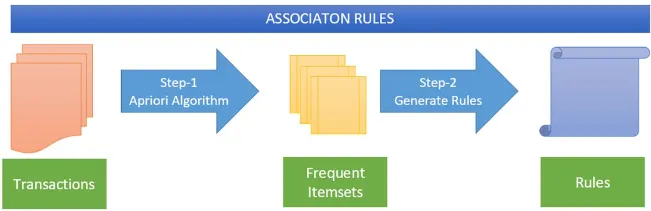
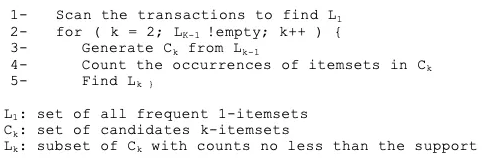

# Market Basket Analysis

General stores, supermarkets like D-Mart, SmartBazaar, and online platforms such as Amazon, Flipkart, and Meesho need to maintain good profitability to run efficiently. One of the ways to achieve this is by performing **Market Basket Analysis**.

Market Basket Analysis is a specialized application of **Association Rule Mining** that focuses specifically on retail and e-commerce scenarios. It examines **transactional data** to uncover patterns and relationships between different products that are purchased together by customers. The term originates from the idea of analyzing a shopper’s physical or digital basket to determine associations between items.

While Association Rule Mining is a broader data mining technique used across industries to discover relationships between various entities or behaviors, **Market Basket Analysis** is a targeted form of it applied to product co-purchases in transactional settings.

At its core, Market Basket Analysis seeks to answer:

* Which products are frequently bought together?
* If a customer purchases product A, what is the likelihood they will also purchase product B?
* How can product placement or bundling be optimized to increase cross-selling?

Market Basket Analysis operates on a dataset where **each record is a transaction**, containing a **set of items purchased together**. By analyzing many such transactions, patterns emerge that reflect customer behavior.

There are several business goals that Market Basket Analysis can support:

* **Product Placement and Store Layout**: Placing products that are frequently bought together closer to one another can improve sales. For example, if bread and butter are frequently co-purchased, placing them side by side can enhance convenience and conversion.
* **Cross-Selling and Upselling**: E-commerce platforms use co-purchase data to recommend complementary items. Amazon’s “Frequently Bought Together” or “Customers also bought” features are based on such analysis.
* **Inventory Management**: Knowing that products A and B are often sold together helps ensure neither goes out of stock at the expense of the other.
* **Promotional Strategies**: Discounts and combo offers can be more effectively designed based on which items are often bought together.
* **E-commerce Platforms**: Personalized recommendations, real-time suggestions, and website layout optimization can be improved using Market Basket insights.

Thus, it contributes to **revenue optimization**, **competitive advantage**, **operational efficiency**, and **risk mitigation**.

Association Rule Mining is also used in other industries:

* **Healthcare**: To identify relationships between diagnoses, treatments, and medications.
* **Financial Services**: To analyze customer behavior, such as card usage patterns, fraud detection, and cross-product selling.
* **Telecommunications**: To discover service bundles or usage patterns and predict churn.

---

## How to Perform Market Basket Analysis?

Market Basket Analysis involves two fundamental steps, which together constitute the **Association Rule Mining** process:

1. **Frequent Itemset Mining**: Identify sets of items that frequently appear together in transactions. This is typically done using algorithms such as **Apriori**.
2. **Association Rule Generation**: Generate “if-then” rules from the frequent itemsets. These rules describe how the presence of certain items in a transaction implies the presence of others.

  

---

### Frequent Itemset Mining

The first step of Market Basket Analysis is to go through the dataset where each row represents a transaction (basket of items bought together), and extract **all unique item combinations**.

We do not pass frequency counts of itemsets to the algorithm. Instead, we provide **raw transaction data**, and the algorithm calculates how often each itemset appears — this frequency is called **support**.

Example transaction itemsets:

* 1-itemset: {Bread}
* 2-itemset: {Bread, Butter}
* 3-itemset: {Bread, Butter, Milk}

The **support** of an itemset is defined as the proportion of transactions that contain that itemset:

$$
\text{Support}(I) = \frac{\text{Number of transactions containing } I}{\text{Total number of transactions}} = \frac{|\{t \in D : I \subseteq t\}|}{|D|}
$$

Consider a dataset with 1000 transactions:

| Item/Itemset    | Frequency | Support |
| --------------- | --------- | ------- |
| {Bread}         | 600       | 0.60    |
| {Butter}        | 400       | 0.40    |
| {Bread, Butter} | 300       | 0.30    |

If the minimum support threshold is 0.25 (25%), all three itemsets above would be considered **frequent**.

A fundamental principle in itemset mining is the **Downward Closure Property**, which states:

* If an itemset is frequent, all of its subsets must also be frequent.
* If an itemset is infrequent, none of its supersets can be frequent.

This property helps reduce computation by pruning unpromising candidate itemsets.

---

### Association Rule Generation and Key Metrics

Once frequent itemsets are discovered, the next step is to generate **association rules** in the form:

$$
X \rightarrow Y
$$

Where:

* **X** (antecedent): the “if” part
* **Y** (consequent): the “then” part

For example: {Bread, Butter} → {Milk}
“If a customer buys bread and butter, they are also likely to buy milk.”

The strength of these rules is measured using the following metrics:

---

#### Support

$$
\text{Support}(X \rightarrow Y) = \text{Support}(X \cup Y)
$$

This indicates how often the entire itemset (X and Y together) appears in the dataset.

Example:
**Rule:** Bread → Butter
Support = 300 / 1000 = 0.30
Interpretation: 30% of all transactions include both items.

---

#### Confidence

$$
\text{Confidence}(X \rightarrow Y) = \frac{\text{Support}(X \cup Y)}{\text{Support}(X)}
$$

This measures the proportion of transactions with X that also contain Y.

Example:
Confidence = 300 / 600 = 0.50
Interpretation: 50% of the customers who bought bread also bought butter.

---

#### Lift

$$
\text{Lift}(X \rightarrow Y) = \frac{\text{Confidence}(X \rightarrow Y)}{\text{Support}(Y)} = \frac{\text{Support}(X \cup Y)}{\text{Support}(X) \times \text{Support}(Y)}
$$

This measures how much more likely Y is to be purchased when X is purchased, compared to when X and Y are independent.

* Lift = 1 → X and Y are independent
* Lift > 1 → Positive association
* Lift < 1 → Negative association

Example:
Lift = 0.50 / 0.40 = 1.25
Interpretation: Customers who buy bread are 1.25 times more likely to buy butter than average.

---

### Example: Rule Evaluation

Consider the following transactional summary for a grocery store (1000 total transactions):

| Item/Combination      | Frequency | Support |
| --------------------- | --------- | ------- |
| Bread                 | 600       | 0.60    |
| Butter                | 400       | 0.40    |
| Milk                  | 500       | 0.50    |
| Bread + Butter        | 300       | 0.30    |
| Bread + Milk          | 350       | 0.35    |
| Butter + Milk         | 200       | 0.20    |
| Bread + Butter + Milk | 150       | 0.15    |

**Rule:** Bread → Butter

| Metric     | Value | Interpretation                               |
| ---------- | ----- | -------------------------------------------- |
| Support    | 0.30  | 30% of transactions contain both             |
| Confidence | 0.50  | 50% of bread buyers also buy butter          |
| Lift       | 1.25  | Positive correlation (1.25× more likely)     |
| Conviction | 1.20  | Moderate dependency between bread and butter |

---

## The Apriori Algorithm

We use the **Apriori algorithm** to perform **frequent itemset mining** in the first step of Market Basket Analysis. It uses a **level-wise iterative approach**, based on the **Downward Closure Property**. We pass a list of transactions (baskets), each containing items, apriori then calculates support from scratch.   
The algorithm is as follows:

  

---

Market Basket Analysis is one of the most practical and impactful applications of data mining for businesses. By systematically identifying frequent itemsets and generating meaningful association rules, organizations can derive actionable insights that drive smarter product placement, targeted promotions, and personalized recommendations.
